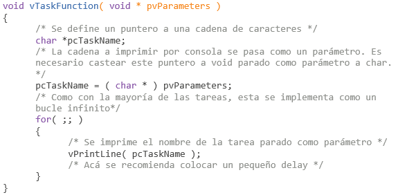
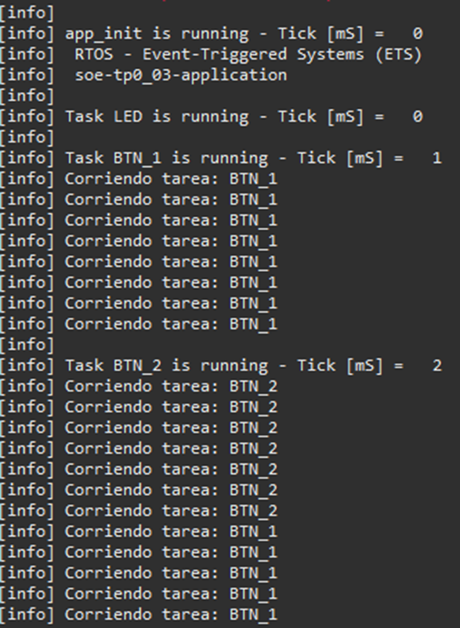
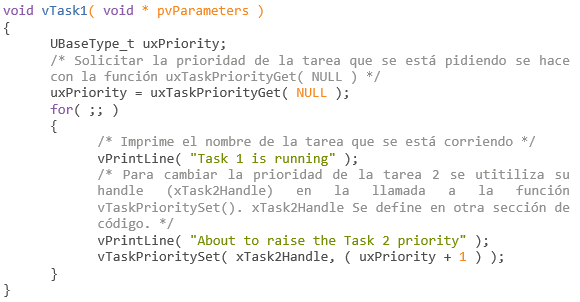
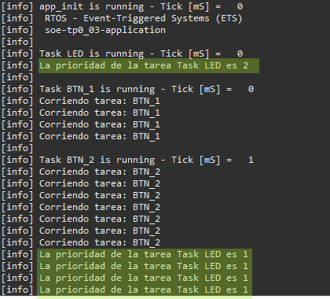

**TP1 – Actividad 03:**

**¿Cómo usar el parámetro de Tarea ?**

**pvParameters:** Las funciones _Task_ aceptan un parámetro de tipo puntero a void. El valor asignado a pvParameters será el valor que se pase hacia el interior de la tarea. Este parámetro tiene el tipo void \* para permitir que el parámetro de la tarea pueda, de manera efectiva e indirecta mediante un casteo, recibir un parámetro de cualquier tipo. Por ejemplo, se pueden pasar tipos enteros a la función de una tarea convirtiendo el entero a un puntero a void en el momento en que se crea la tarea, y luego convirtiendo nuevamente ese parámetro de puntero a void a un entero dentro de la propia definición de la función de la tarea.

Un ejemplo de aplicación es el siguiente:

Acto seguido se procedió a modificar task_btn para poder gestionar dos botones diferentes usando el parámetro de Tarea para diferenciarlos. En particular se buscó que cada uno imprimiera por consola durante su ejecución un identificador pasado como parámetro. En la siguiente figura se observa el resultado

En esta imagen se puede notar al final que cambian las tareas que están corriendo y se pasa por parámetro el identificador de la misma.
Para lograr esto, además de realizar lo explicado con el ejemplo anterior dentro de la task_btn, se debió modificar cosas de app. En este archivo se agregaron unos punteros a char (denominados "parameter_char_x"), que fueron colocados como parámetros en la creación de cada tarea. Al colocarlos como parámetros debieron ser casteados a (void *), ya que este es el tipo que se recibe en la creación de una tarea y dentro de la implementación de la task_btn fueron recasteados a char *.

**¿Cómo cambiar la prioridad de una Tarea ya creada?**

El Scheduler siempre siempre selecciona la tarea con mayor prioridad en el estado Ready para que se inicie a procesar y se ponga en el estado Running.

Para que una tarea emparejada con otra le cambie laprioridad se usa la función de API vTaskPrioritySet().

El siguiente ejemplo crea dos tareas con prioridades diferentes. Ninguna de ellas realiza un llamado a una función de API que las bloquee, por lo que ambas estarán siempre en el estado Ready o Running. Por lo tanto, la tarea de mayor prioridad será la que siempre elija el Scheduler para que se esté procesando (esté en el estado Running).

El funcionamiento del siguiente ejemplo es el siguiente:

1. Se crea la **Task1** con prioridad más alta entre las dos tareas para asegurarse que sea la primera en ponerse en estado Running. La **Task1** imprime unas cadenas de caracteres antes de aumentar la prioridad de **Task2** por encima de la prioridad de la **Task1**.
2. La Task2 entra en estado Running tan pronto como su prioridad sea la más alta. Sólo una tarea puede estar corriéndose por vez, por lo que cuando la **Task2** está en Running, la **Task1** está en el estado Ready.
3. La **Task2** imprime un mensaje antes de volver a colocar su prioridad como inferior a la de la **Task1**.
4. Cuando la **Task2** coloca su prioridad como inferior, la **Task1** vuelve a tener la prioridad más alta de las dos tareas, por lo que vuelve a entrar en el estado de Running, forzando que la **Task2** entre en el estado Ready.
5. 

Ahora al crear la tarea LED_1 se creó con prioridad 2, que es mayor a la prioridad de cualquiera de los dos botones. Con esto, debería correr únicamente dicha tarea. Sin embargo, como dentro de su misma implementación se decrementó su prioridad de forma tal que la prioridad de las 3 tareas sea igual. Por este motivo, en la figura a continuación se puede ver que se ejecutan todas las tareas.
Para evidenciar el cambio de prioridad de la tarea LED_1 se imprimió por pantalla la prioridad de esta. En la siguiente figura se puede ver resaltado las líneas donde se puede observar dicho cambio.

